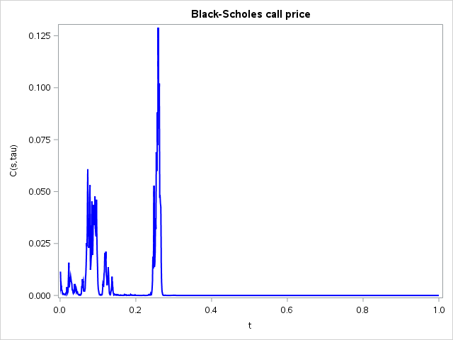

[](http://quantlet.de/)

## [](http://quantlet.de/) **SFM_BSbm** [](http://quantlet.de/)

```yaml


Name of QuantLet : SFM_BSbm

Published in : Stat_fin_markets

Description : 'SFM_BSbm plots BS price as a function of a Brownian Motion S_t.'

Keywords : 
- Black Scholes
- brownian motion
- call
- put
- option

Author: Daniel Traian Pele

Submitted : Fri, 22 March 2019
Input:        'S0	 - initial price;
				 K	 - strike price;
			   r	 - interest rate;
				 si	 - sigma; 
				 tau - maturity.'

Output:   'Plot of the Call Black-Scholes price as a function of a
               Brownian Motion S_t.'

Example:      'The plot is generated for the following parameter values:
             S0=100, K=110, r=0.05, si=0.3, tau=0.02.'

```



