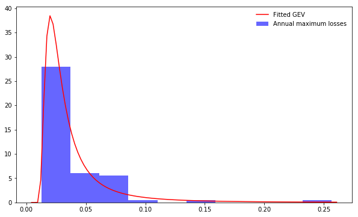
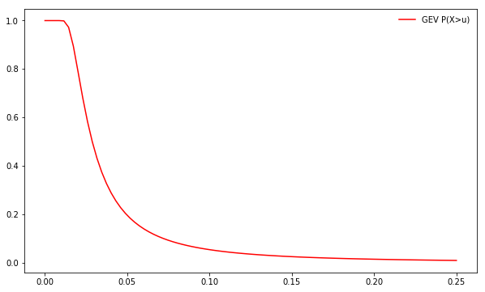
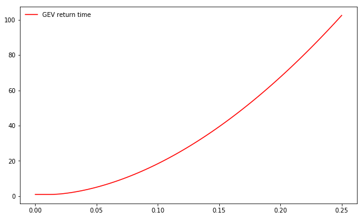

[](http://quantlet.de/)

## [](http://quantlet.de/) **SFM_Block_maxima_GEV** [](http://quantlet.de/)

```yaml

Name of QuantLet : SFM_Block_maxima_GEV

Published in : Stat_fin_markets

Description : 'This program applies the Block Maxima method to annual losses of DJIA.'

Keywords : 'Extreme Value Theory, Block Maxima, log-returns, losses.'

Author : Daniel Traian Pele

Submitted : Fri, 22 March 2019

Output:   'Return time (years) of an annual maximum loss higher than a certain threshold.'


```







### [IPYNB Code: SFM_Block_maxima_GEV.ipynb](SFM_Block_maxima_GEV.ipynb)


automatically created on 2019-03-29