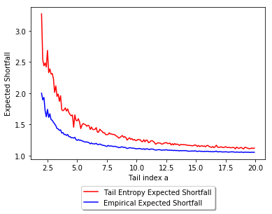

[](http://quantlet.de/)

## [](http://quantlet.de/) **SFM_ES_Pareto** [](http://quantlet.de/)

```yaml

Name of QuantLet : SFM_ES_Pareto

Published in : Stat_fin_markets

Description : 'This quantlet estimates Tail Entropy Expected Shortfall for a Pareto Distribution.'

Keywords : 
 - Pareto
 - entropy
 - Expected Shortfall
 - Tail Entropy

 
Author : Daniel Traian Pele


Submitted : Sat, 11 May 2019 by Daniel Traian Pele


```



### [IPYNB Code: SFM_ES_Pareto.ipynb](SFM_ES_Pareto.ipynb)


automatically created on 2019-07-16