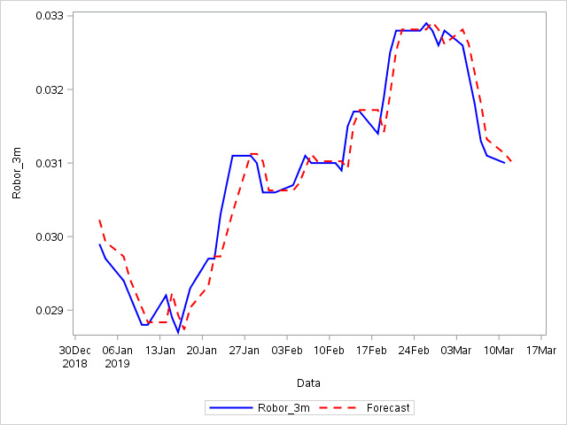

[](http://quantlet.de/)

## [](http://quantlet.de/) **SFM_Est_Vasicek** [](http://quantlet.de/)

```yaml

Name of QuantLet : SFM_Est_Vasicek

Published in : Stat_fin_markets

Description : 'SFM_Est_Vasicek estimates the parameters of the Vasicek model for the ROBOR_3m interest rate.'

Keywords : Vasicek, interest rate

Author: Daniel Traian Pele

Submitted : Fri, 22 March 2019

Output:   'Parameters of the Vasicek model and forecasted values of the ROBOR_3m.'

Dataset: 'ROBOR_3m.csv'


```



### SAS Code
```sas

* Quantlet:     SFM_Est_Vasicek
* ---------------------------------------------------------------------
* Description:  SFM_Est_Vasicek estimates the parameters of a 
				Vasicek process for ROBOR-3M
* ---------------------------------------------------------------------
* ---------------------------------------------------------------------
* Keywords:     Vasicek, interest rate, process, stochastic, estimation
* ---------------------------------------------------------------------
* ---------------------------------------------------------------------
* Author:       Daniel Traian Pele
* ---------------------------------------------------------------------;


proc import datafile="/home/danpele/Stat_fin_markets/ROBOR_3m.csv" dbms=csv
out=date replace;
run;

data date;set date;
Robor_3m=Robor_3m/100;

data date;set date;
if year(data)>=2018;
year=year(data);
run;


proc sgplot data=date;
series x=data y=Robor_3m;
run;

proc model data=date outmodel=Model;
 where year<2019;
    Robor_3m = lag(Robor_3m) +  a*(b - lag(Robor_3m));
     h.Robor_3m= sigma**2;
     label a = "Speed of Mean Reversion";
     label b = "Long term Mean";
     label sigma ="Constant part of variance";
   fit Robor_3m/ fiml out=predict outpredict;

  run;
  
 
proc model data=date model=Model;

   range year=2019;
   solve Robor_3m / nahead=1 out=forecast details;
  run;
  
  
data forecast;set forecast;
rename Robor_3m=Forecast;


data forecast;merge date(in=a) forecast(in=b);
by year;
if a and b;
run;

proc sgplot data=forecast;
series x=data y=Robor_3m /lineattrs = (color = blue THICKNESS = 2);
series x=data y=Forecast /lineattrs = (color = red THICKNESS = 2 pattern=dash);
run;

*Forecast performance assesment;
data forecast;set forecast;
error=Forecast-Robor_3m;
run;

proc means data=forecast mean std;
var error;
run;

```

automatically created on 2019-03-29