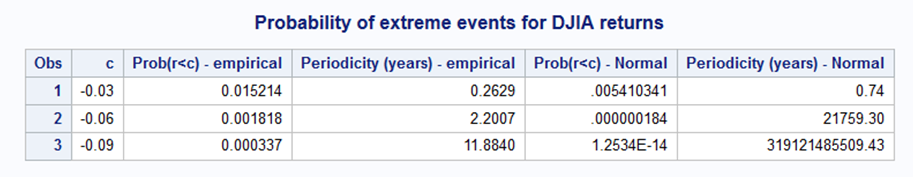

[](http://quantlet.de/)

## [](http://quantlet.de/) **SFM_Ext_events** [](http://quantlet.de/)

```yaml

Name of QuantLet : SFM_Ext_events

Published in : Stat_fin_markets

Description : 'Estimates the probability of extreme log-returns using empirical and Normal distribution; the recurrence time is also estimated.'

Keywords : 'extreme, log-return, Normal'

Author: Daniel Traian Pele

Submitted : Sun, 24 March 2019

Dataset: 'djia.csv'


```

