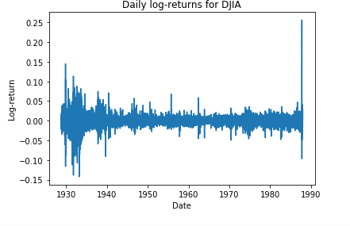
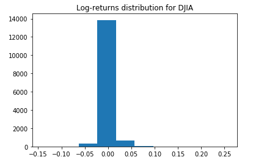
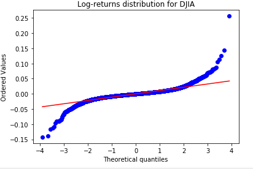

[](http://quantlet.de/)

## [](http://quantlet.de/) **SFM_Ext_ret** [](http://quantlet.de/)

```yaml

Name of Quantlet: 'SFM_Ext_ret'

Published in: 'Stat_fin_markets'

Description: 'This program tests the hypothesis that the DJIA log-returns are drawn from
             a Normal distribution and estimates the probability of extreme negative returns.'

Keywords: 'Normal distribution, extreme returns, DIJA'

Author: 'Dragos Cioata'

Submitted: 27 March 2019


Datafile: 'djia.csv.'
```





