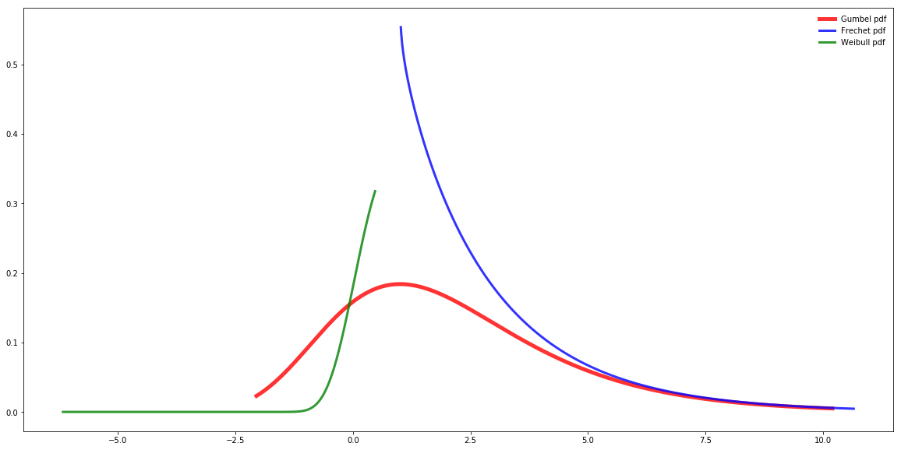

[](http://quantlet.de/)

## [](http://quantlet.de/) **SFM_GEV_distribution** [](http://quantlet.de/)

```yaml

Name of QuantLet : SFM_GEV_distribution

Published in : Stat_fin_markets

Description : 'Simulates the following GEV Distributions: Weibull, Frechet, Gumbel.'

Keywords : Weibull, Frechet, Gumbel, GEV, simulation

Author: Daniel Traian Pele

Submitted : Fri, 22 March 2019

Output:   'Probability density function of the GEV distributions'


```



### [IPYNB Code: SFM_GEV_distribution.ipynb](SFM_GEV_distribution.ipynb)


automatically created on 2019-03-29