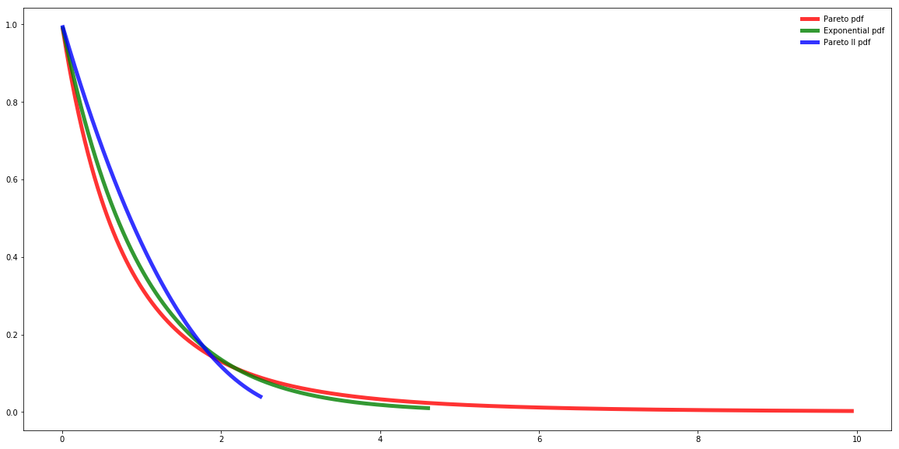

[](http://quantlet.de/)

## [](http://quantlet.de/) **SFM_Gen_Pareto** [](http://quantlet.de/)

```yaml

Name of QuantLet : SFM_Gen_Pareto

Published in : Stat_fin_markets

Description : 'SFM_Gen_Pareto simulates Generalized Pareto Distributions: Pareto, Exponential, Pareto II.'

Keywords : Pareto, Exponential, Pareto II

Author: Daniel Traian Pele

Submitted : Fri, 22 March 2019

Output:   'Probability density functions of the selected distributions.'


```



### [IPYNB Code: SFM_Gen_Pareto.ipynb](SFM_Gen_Pareto.ipynb)


automatically created on 2019-03-29