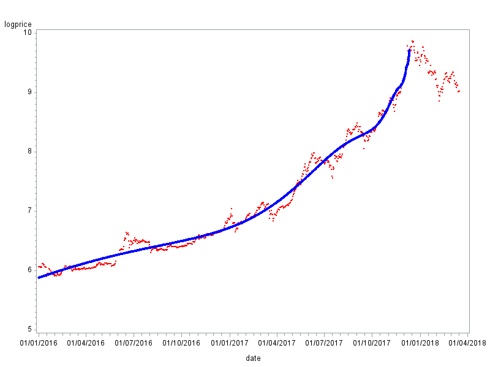

[](http://quantlet.de/)

## [](http://quantlet.de/) **SFM_LPPL_BTC** [](http://quantlet.de/)

```yaml

Name of QuantLet : SFM_LPPL_BTC

Published in : Stat_fin_markets

Description : 'This quantlet estimates the LPPL model for Bitcoin and estimates the most probable time of the crash.'

Keywords : 
 - cryptocurrency
 - Log periodic power law
 - Bitcoin
 - LPPL
 - crash
 
Author : Daniel Traian Pele


Submitted : Sat, 11 May 2019 by Daniel Traian Pele

Datafiles : 'btc.csv'


```

