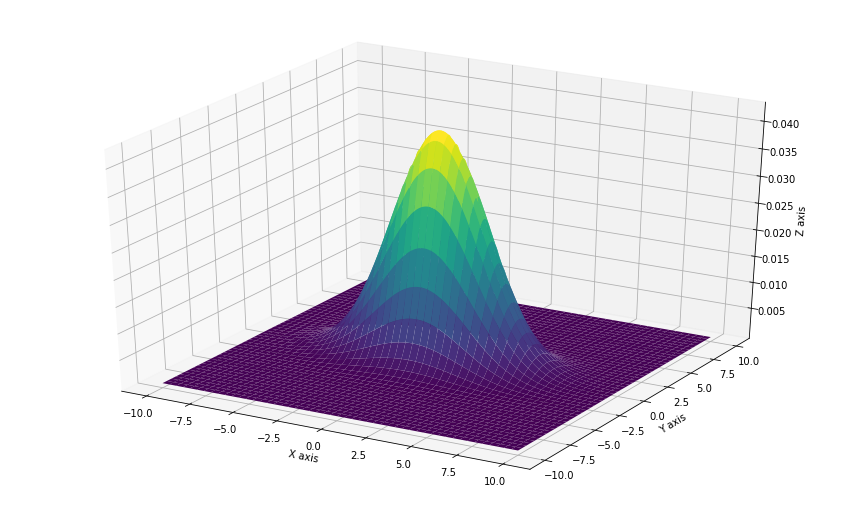

[](http://quantlet.de/)

## [](http://quantlet.de/) **SFM_MND** [](http://quantlet.de/)

```yaml

Name of QuantLet : SFM_MND

Published in : Stat_fin_markets

Description : 'Simulates a bivariate Normal distribution.'
Keywords : Normal, bivariate, density

Author: Daniel Traian Pele

Submitted : Fri, 22 March 2019

Output:   'PDF plot of a bivariate Normal distribution.'


```



### [IPYNB Code: SFM_MND.ipynb](SFM_MND.ipynb)


automatically created on 2019-03-29