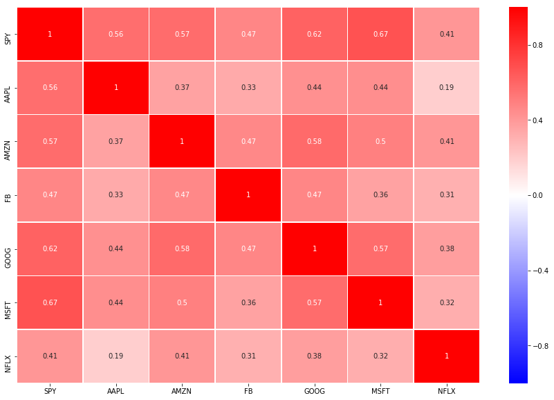
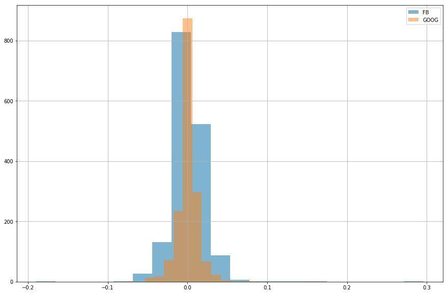

[](http://quantlet.de/)

## [](http://quantlet.de/) **SFM_Quant_fin** [](http://quantlet.de/)

```yaml

Name of QuantLet : SFM_Quant_fin

Published in : Stat_fin_markets

Description : 'Analysis of the evolution of prices of shares of AAPL, AMZN, GOOG, FB, NFLX, MSFT, SPY between 2013 and 2019.'

Keywords : evolution, daily returns, cumulative returns, bollinger bands, volatility, random walk, risk

Author: Denisa-Maria Ilie, Claudia-Andreea Toma

Submitted : Wed, 10 July 2019

Dataset: Alpha Vantage API

Example: 'Test the existence of correlations between AMZN and MSFT stock prices through scatter plots.'
```





### [IPYNB Code: SFM_Quant_fin.ipynb](SFM_Quant_fin.ipynb)


automatically created on 2019-07-16