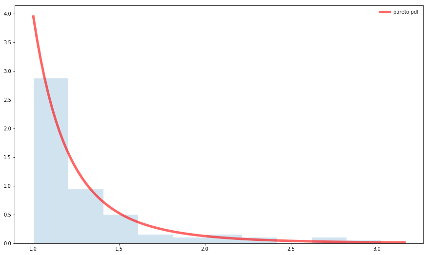

[](http://quantlet.de/)

## [](http://quantlet.de/) **SFM_Sim_pareto** [](http://quantlet.de/)

```yaml

Name of QuantLet : SFM_Sim_pareto

Published in : Stat_fin_markets

Description : 'SFM_Sim_pareto simulated a Pareto distribution.'

Keywords : Pareto, density, simulation

Author: Daniel Traian Pele

Submitted : Fri, 22 March 2019


```



### [IPYNB Code: SFM_Sim_pareto.ipynb](SFM_Sim_pareto.ipynb)


automatically created on 2019-03-29