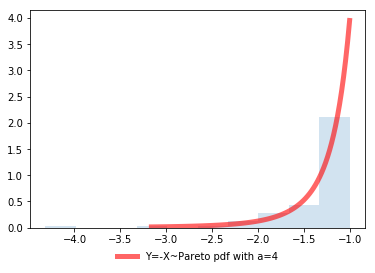

[](http://quantlet.de/)

## [](http://quantlet.de/) **SFM_Sim_Pareto_like** [](http://quantlet.de/)

```yaml

Name of QuantLet : SFM_Sim_Pareto_like

Published in : Stat_fin_markets

Description : 'SFM_Sim_pareto simulates Y=-X ~ Pareto distribution.'

Keywords : Pareto, density, simulation

Author: Daniel Traian Pele

Submitted : Thu, 16 May 2019


```



### [IPYNB Code: SFM_Sim_Pareto_like.ipynb](SFM_Sim_Pareto_like.ipynb)


automatically created on 2019-07-16