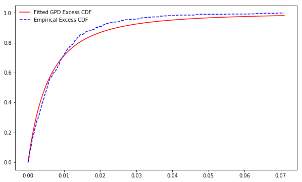

[](http://quantlet.de/)

## [](http://quantlet.de/) **SFM_GDP_excess_losses** [](http://quantlet.de/)

```yaml

Name of QuantLet : SFM_GDP_excess_losses

Published in : Stat_fin_markets

Description : 'This program fits Generalized Pareto Distributions to excess losses of stock/index.'
Keywords : Extreme Value Theory, Pareto ,excess, losses

Author: Daniel Traian Pele

Submitted : Fri, 22 March 2019

Output:   'Parameters of the estimated GPD distribution.'


```

